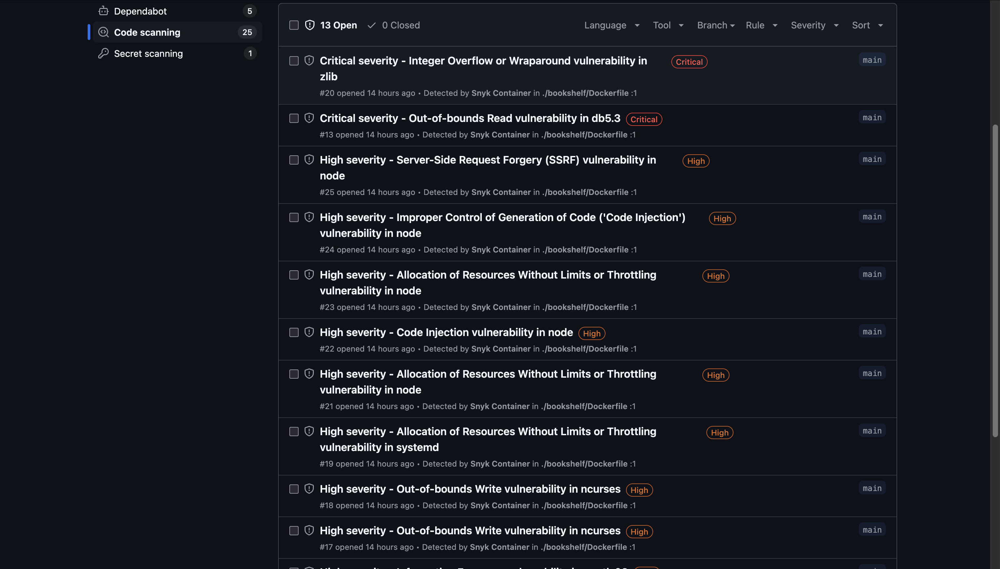

# DevSecOps-Demo
Repository for testing & validating DevSecOps implementation 

## Assignment 1: Implementing Shift Left Security in CI/CD Pipeline

### Objective: 
Implement security checks early in the development process by integrating them into your CI/CD pipeline using GitHub Actions or GitLab CI.

### Pipelines:
| Security Check for Bookshelf Application (Nodejs) |
| --------------- |
|[](https://github.com/MayurManjrekar/DevSecOps-Demo/actions/workflows/security.yaml)|

### What the Pipeline Does
This GitHub Actions pipeline performs automated security checks on your Node.js application located in the bookshelf/ directory. It consists of three main jobs:
* Linting (Code Quality & Syntax Checks)
* Secrets Detection (Secret Leakage Detection)
* Dependency Auditing (Vulnerability Detection)

Each job runs performs specific tasks to ensure the codebase is secure, syntactically correct, and free from obvious security risks.

### Triggers
This workflow is triggered under the following conditions:

* Manually (workflow_dispatch)
* On Pull Request Events: When a pull request is:
  - Opened
  - Reopened
  - Synchronized
* On Push to main branch, only if changes occur in:
  - The `bookshelf/` directory
  - workflow file itself `.github/workflows/security.yaml`

**Note:** If a pull request is labeled `Hot Deployment`, the workflow will skip `Secrets-check` & `Auditing` job
This allows for immediate application releases without blocking on security scans, useful for critical hotfixes or fast deployment cycles. However, it's recommended to perform these checks post-deployment in such cases.

### Job Descriptions and Tools Used

| Security Check | Tool | Description| output |
|----------------|------|------------| ------ |
| Linting Job | ESLint | ESLint is a static code analysis tool for JavaScript. Its primary purpose is to identify and report on patterns found in JavaScript code, the goal is making code more consistent and checking for any syntax errors. | Contains `eslint_report.txt`, showing any linting/syntax issues in tabular format. |
| Secret scanning | Gitleaks | Its purpose was to identify any committed secrets in your Node.js project (bookshelf directory) whenever code was pushed or a pull request was created. If Gitleaks detected any potential secrets. | Contains `gitleaks-report.json`, which lists any detected secrets or credentials in code. |
| Security Vulnerability Check | npm audit | It is a security tool built into Node.js that scans your project's dependencies for known vulnerabilities. Reports issues by severity level (low, moderate, high, critical). | Contains `npm_audit_report.json`, a JSON report of discovered high or critical-level dependency vulnerabilities. |

### Tool selection & criteria
I selected these tools based on several practical and strategic considerations:
* Seamless CI/CD Integration: All tools integrate easily into GitHub Actions, enabling smooth automation without complex setup.
* Open Source & Community-Supported: These are open-source solutions with strong community backing, ensuring transparency, regular updates, and cost-effectiveness.
* Language-Specific Precision: Each tool is optimized for its target language or ecosystem, delivering high accuracy and minimizing false positives.
* Customizability: They support configuration through custom rule sets or config files, allowing fine-tuning to fit our codebase and security policies.
* No Licensing or API Keys Required: These tools run entirely within the CI environment without requiring external API keys, tokens, or paid licenses.
* Purpose-Built for their Use Cases: Each tool is widely adopted and trusted for its specific domain—linting, secrets detection, or dependency auditing—making them reliable for targeted security and quality checks.


## Assignment 2: Enable GHAS for a repository

### Objective:
GitHub Advanced Security features for a repository.

### Pipelines:
| CodeQL Scan for Bookshelf Application (Nodejs) & GitHub Actions workflow|
| --------------- |
|[](https://github.com/MayurManjrekar/DevSecOps-Demo/actions/workflows/codeql.yml) |

### What the Pipeline Does
Runs advanced CodeQL analysis weekly and on code changes to detect vulnerabilities in JavaScript/TypeScript and GitHub Actions code.

### Triggers
This workflow is triggered under the following conditions:
* Push to main branch
  - The `bookshelf/` directory
  - workflow file itself `.github/workflows/codeql.yaml`
* Pull request targeting main branch
* Scheduled run every Monday at 00:19 UTC

### Security Analysis and Tools Used

| Security Check        | Tool | Description|
|-----------------------|------|------------|
| Documentation/Process | Policy | A file `(SECURITY.md)` that outlines how users and contributors should report vulnerabilities. It helps standardize and communicate your project's vulnerability disclosure process. |
| Manual Vulnerability Disclosure & Fix Tracking | Security Advisory | Lets maintainers privately disclose, discuss, and patch vulnerabilities in their repositories. Once resolved, advisories can be published as CVEs for public awareness and tracking. |
| Dependency Vulnerability Detection | Dependabot Alerts | Scans the dependency graph of your project against GitHub’s advisory database and alerts you when known vulnerabilities are found in third-party packages. |
| Static Application Security Testing (SAST) | Code Scanning Alerts | Automatically analyzes source code for vulnerabilities and coding errors using CodeQL or third-party tools. Highlights issues like injection flaws, logic errors, and unsafe API usage. |
| Credential & Token Leakage Detection | Type of Check | Detects accidentally committed secrets such as API keys, tokens, or passwords in your Git history or current code and alerts repository maintainers to prevent misuse. |

### Code Scanning Security Report
| Security Check |Vulnerability Description | Severity | Recommended Mitigation Strategy |
|----------------|---------------------------|----------|---------------------------------|
| Code scanning  | Workflow does not contain permissions | Medium | The issue indicates that the GitHub Actions workflow has default (excessive) permissions, which violates the principle of least privilege. To resolve it we can add `permissions` block to our workflow to restrict access.|
| Dependabot Alert | @google-cloud/firestore Logging Issue | Moderate | The alert warns that older versions of the @google-cloud/firestore library (before v6.1.0) & its code dependency. we can upgrade the dependency within `package.json` |


* Permission block added to the workflow 
```
permissions:
  contents: read
```


## Assignment 4: Using SonarQube for SAST capabilities

### Objective: 
Integrate SonarQube and upload the reports.

### What is SonarQube? 
SonarQube is an open-source platform for continuous inspection of code quality. It provides static analysis of your code to identify potential issues, such as:
* Bugs 
* Vulnerabilities 
* Code Smells (bad practices or poor maintainability)
* Duplications 

**Metrics & Reports:**
Generates detailed reports on code quality and security issues. Displays quality gates for each project (e.g., whether your code meets the defined quality standards).


### What is Gradle?
Gradle is a powerful open-source build automation tool used primarily for:
* Compiling code
* Running tests
* Packaging applications
* Managing dependencies
* Running quality checks (like SonarQube analysis)

### Prerequisites
* Docker
* Java JDK (>=11)
* Gradle (>=8.x)
* VS Code or preferred IDE

### Step 1: Install & Run Docker
* Install Docker Desktop
* Download and [install Docker](https://docs.docker.com/desktop/setup/install/mac-install/)

### Step 2: Run SonarQube in Docker
* Open a terminal and run the following command:
```
docker pull sonarqube
docker run --name sonarqube-custom -p 9000:9000 sonarqube
```
* Access SonarQube, Open your browser and visit:
```
http://localhost:9000
```

* Login (First time only):
```
Username: admin
Password: admin
```

* Change the password.


### Step 3: Installing Dependencies
* Install Homebrew
```
/bin/bash -c "$(curl -fsSL https://raw.githubusercontent.com/Homebrew/install/HEAD/install.sh)"
echo 'eval "$(/opt/homebrew/bin/brew shellenv)"' >> ~/.zprofile
eval "$(/opt/homebrew/bin/brew shellenv)"
```

* Install Java:
```
brew install openjdk@17
export JAVA_HOME="/opt/homebrew/opt/openjdk@17"
export PATH="$JAVA_HOME/bin:$PATH"
```

* Install Gradle:
```
brew install gradle
```

* Install Node.js and npm
```
brew install node
```


### Step 4: Create build.gradle for Your Project
* In your project directory, create a build.gradle file with the following content:
```
plugins {
    id 'org.sonarqube' version '3.3'
    id 'java' // If you have Java code in the project as well
}

repositories {
    mavenCentral()  // This ensures Gradle can download dependencies from Maven Central
}

sonarqube {
    properties {
        property "sonar.projectKey", "bookshelf-app"
        property "sonar.organization", "DevSecOps-Demo"
        property "sonar.host.url", "http://localhost:9000"
        property "sonar.token", project.findProperty("sonar.token") ?: System.getenv("SONAR_TOKEN")

        // Specify the source directories for JavaScript
        property "sonar.sources", "books, lib"  // Include the JS code directories
        property "sonar.tests", "test"  // Your test directory

        // coverage report path
        property "sonar.javascript.lcov.reportPaths", "build/reports/tests/lcov.info"
    }
}

dependencies {
    testImplementation 'org.junit.jupiter:junit-jupiter:5.9.3' // Keep it if you're using JUnit for other tests

    // You may add additional dependencies related to JS testing frameworks if required
}

test {
    useJUnitPlatform()
}
```
#### Test Case file 
* `test/app.test.js`
```
const app = require('../app');

const request = require('supertest');

describe('Requests have valid status codes', () => {
  it('should get 302', (done) => {
    request(app).get('/').expect(302, done);
  }),
    it('should get books', (done) => {
      request(app).get('/books').expect(200, done);
    });
  it('should get books/add form', (done) => {
    request(app).get('/books/add').expect(200, done);
  });
});

describe('Should have logs and errors endpoints as described in docs for Stackdriver', () => {
  it('should have logs endpoints', (done) => {
    request(app).get('/logs').expect(200, done);
  }),
    it('should have errors endpoint', (done) => {
      request(app).get('/errors').expect(500, done);
    });
});
```

### Step 5: Set Up SonarQube Authentication Token
* Generate Token:
* In SonarQube UI: Go to My Account > Security > Generate Token.
* Set SONAR_TOKEN Environment Variable:
```
export SONAR_TOKEN="<your_generated_token>"
```

### Step 6: Run SonarQube Analysis
* Generates test and coverage reports 
```
npm run test -- --coverage
```

* From your project directory, run:  Builds the app and uploads analysis + coverage to SonarQube
```
gradle build sonarqube
```

##### Gradle Command: `gradle clean build sonarqube`

| Command Part         | Description    | Purpose   |
|----------------------|----------------|-----------|
| `build`    | Compiles the source code, runs unit tests, and creates output artifacts | Validates that the code builds correctly and tests pass    |
| `sonarqube`| Analyzes code quality and uploads results to the SonarQube server       | Identifies bugs, code smells, and vulnerabilities in your codebase   |


### Report

#### Summary

| Metric                | Description   |  Status          |
| --------------------- | ------------- | ---------------- |
| **Security**          | Checks for known vulnerabilities and insecure code | A (0 issues)       |
| **Reliability**       | Detects bugs and runtime failure risks             | A (0 issues)       |
| **Maintainability**   | Detects code smells affecting maintainability      | A (2 issues)       |
| **Coverage**          | Shows how much of the code is covered by tests     | 35.7% (109 lines) |
| **Duplications**      | Highlights repeated code                           | 0.0%               |
| **Security Hotspots** | Sensitive code that may need manual review         | 0 hotspots         |
| **Accepted Issues**   | Valid issues intentionally left unresolved         | 0 accepted         |


#### SonarQube UI


#### SonarQube Report


#### Dectected Issues


### Reference
* [Download Docker](https://docs.docker.com/desktop/setup/install/mac-install/)
* [Sonar analysis Meduim Post](https://allancarneirosantos.medium.com/how-to-get-full-sonar-analysis-from-local-code-8284a883149e)
* [SonarQube commands](https://docs.gradle.org/8.14/userguide/command_line_interface.html#sec:command_line_warnings)


## Assignment 5: Integrating SCA in CI pipeline

### Objective:
Implement Software Composition Analysis (SCA) to identify and manage vulnerabilities in open-source components and report the findings.

### What is Software Composition Analysis (SCA)?
Software Composition Analysis (SCA) is a process of identifying and managing the open-source components and dependencies used in a software project. It helps understand the security, license, and quality risks associated with third-party software.
Key Features of SCA:
* Dependency Scanning:
* Vulnerability Detection:
* License Compliance: Checks for open-source license compliance to avoid legal risks.
* Version Management: Alerts you to outdated or vulnerable versions of libraries.
* Supply Chain Security: Detects malicious or compromised packages in your supply chain.

### What is SBOM ?
SBOM (Software Bill of Materials) is a comprehensive inventory of all components, libraries, and dependencies within a software project. It provides transparency into the software's composition, aiding in vulnerability management, license compliance, and supply chain security
```
snyk sbom --format=cyclonedx1.6+json --all-projects --json-file-output=mysbom.json
```
**Note:** The snyk sbom command is designed to generate a Software Bill of Materials (SBOM) for your project. However, this functionality is exclusive to customers on Snyk Enterprise plans.

### Pipelines:
| SCA Scan using Snyk|
| --------------- |
| [](https://github.com/MayurManjrekar/DevSecOps-Demo/actions/workflows/snyk-scan.yaml) |

### Triggers:
The workflow is triggered on:
* Manually (workflow_dispatch)
* On Pull Request Events: When a pull request is:
  - Opened
  - Reopened
  - Synchronized (when new commits are pushed to the pull request branch)
* On Push to main branch, only if changes occur in:
  - The `bookshelf/` directory
  - workflow file itself `.github/workflows/snyk-scan.yaml`

### Workflow Permissions Block:
```
permissions:
  contents: read
  security-events: write
  actions: read
```
* contents: read - Allows the workflow to read your repository’s files.
* security-events: write - Required to upload SARIF files to GitHub Security Dashboard.
* actions: read - Allows the workflow to run GitHub Actions.

**Note:** To publish SARIF files to `GitHub Security`, you also need to enable Code Scanning for your repository in the settings.

### Commands: 
| **Feature** | **`snyk test`** | **`snyk monitor`** |
|--------------|-----------------|--------------------|
| **Purpose** | Immediate security testing | Long-term vulnerability monitoring |
| **Output** | CLI results, JSON, SARIF | Snyk dashboard |
| **Alerts** | No | Yes, continuous alerts |
| **Impact on Snyk Dashboard** | No project created | Creates a project for ongoing monitoring |
| **Typical Use** | CI/CD pipelines, local testing | Continuous security monitoring |
| **Common Options** | `--json`, `--sarif-file-output`, `--all-projects` | `--project-name`, `--tags`, `--all-projects` |


### Setting Up Snyk
### Step 1: Create a Snyk Account
1. Go to [Snyk.io](https://snyk.io/) and create a free account.
2. Complete the sign-up process using your email or GitHub

### Step 2: Generate Snyk API Token
1. Once logged in, go to the Settings page.
2. Click on "API Token".
3. Click "Generate" to create a new API token.
4. Copy the generated token.


### Step 3: Store the API Token in GitHub Secrets
1. Go to your GitHub repository.
2. Navigate to Settings → Secrets and variables → Actions → New repository secret.
3. Set the Name as SNYK_TOKEN.
4. Paste the copied API token as the Value.

### Step 4: Reference the Token in Your Workflow
Add the following env block in your GitHub Actions workflow to use the Snyk token:
```
env:
  SNYK_TOKEN: ${{ secrets.SNYK_TOKEN }}
```

### Step 5: Setting up Snyk for CLI (Vs code editor)
1. Install the Snyk CLI
```
npm install -g snyk
```

2. Authenticate with Snyk: This will open a browser window where you can log in to your Snyk account.
```
snyk auth
```


### SBOM Report
| **Name**         | **Version** | **License** | **PURL**                         |
| ---------------- | ----------- | ----------- | -------------------------------- |
| express          | 4.21.2      | MIT         | `pkg:npm/express@4.21.2`         |
| lodash.camelcase | 4.3.0       | MIT         | `pkg:npm/lodash.camelcase@4.3.0` |
| fast-deep-equal  | 3.1.3       | MIT         | `pkg:npm/fast-deep-equal@3.1.3`  |
| google-gax       | 2.30.5      | Apache-2.0  | `pkg:npm/google-gax@2.30.5`      |
| body-parser      | 1.20.3      | MIT         | `pkg:npm/body-parser@1.20.3`     |

### Vulnerability Report
| Severity | Vulnerability Description | Affected Package(s) & Version(s) | Remediation Recommendation | |
| -------- | ------------------------- | -------------------------------- | -------- | ----------------- |
| Medium   | Insecure Storage of Sensitive Information  | `@google-cloud/firestore` v5.0.2  | Upgrade to `@google-cloud/firestore` v6.2.0 or higher. |  |
| High     | Prototype Pollution (CVE-2023-36665)  | `protobufjs` v6.11.3 (via `google-gax` > `protobufjs`)       | Upgrade `protobufjs` to v6.11.4, v7.2.4, or higher. |    |
| High     | Denial of Service (DoS) (CVE-2022-24434)  | `dicer` v0.2.5 (via `busboy` > `dicer`)   | Upgrade `multer` to v1.4.5-lts.1 or higher. |   |
| High     | Uncaught Exception  | `multer` v1.4.4 | Upgrade to `multer` v1.4.5-lts.1 or higher. |  |
| High     | Missing Release of Memory after Effective Lifetime | `multer` v1.4. | Upgrade to `multer` v1.4.5-lts.1 or higher.  |  |
| Medium   | Uncontrolled Resource Consumption (CVE-2024-37168) | `@grpc/grpc-js` v1.6.12 (via `google-gax` > `@grpc/grpc-js`) | Upgrade `@grpc/grpc-js` to v1.8.22, v1.9.15, v1.10.9, or higher.  | |

### Resolving `Insecure Storage of Sensitive Information ` Vulnerability
* Update @google-cloud/firestore to version 6.2.0 or higher:
```
npm install @google-cloud/firestore@^6.2.0
```

* Proof of concept


### Snyk UI


### Snyk UI Logs


### Workflow log


### Github Security Published log


### Published Report


### References
* [Snyk Actions](https://github.com/snyk/actions/tree/master/node)
* [Snyk CLI Commands](https://docs.snyk.io/snyk-cli/cli-commands-and-options-summary)
* [Snyk SBOM](https://snyk.io/blog/creating-sboms-snyk-cli/)


## Assignment 6: Image Scanning
### Objective: 
Implement image scanning into the CI/CD pipeline to ensure container image security.

| Docker Image Scan using Snyk & Trivy|
| --------------- |
|[](https://github.com/MayurManjrekar/DevSecOps-Demo/actions/workflows/docker-scan.yaml)|


### Snyk
Snyk is a security platform that helps identify and fix vulnerabilities in container images. It scans container images through the Snyk Web UI, CLI, or integrations with container registries like Docker Hub. Snyk provides detailed reports on vulnerabilities found in base images and application dependencies, along with actionable remediation advice, such as opening fix pull requests or suggesting image upgrades.

### Trivy
Trivy is an open-source vulnerability scanner developed by Aqua Security, designed to detect security issues in container images, file systems, and repositories. It scans for known vulnerabilities (CVEs) in OS packages and application dependencies, as well as misconfigurations and secrets. Trivy is known for its ease of use, requiring minimal setup, and can be integrated into CI/CD pipelines to automate security checks. 

### Docker Image Vulnerability Scan Workflow
This GitHub Actions workflow is designed to **scan Docker images for security vulnerabilities** using **Snyk**, upload the results to the **GitHub Security Dashboard**, **Snyk Dashboard** and save a detailed **HTML report** as a build artifact.

### Features:
- **Docker Image Build:** Builds the Docker image for the **`bookshelf-app`**.
- **Snyk Vulnerability Scanning:** Scans the Docker image for known vulnerabilities.
- **SARIF Upload:** Publishes the scan results to the GitHub Security Dashboard.
- **Snyk Monitoring:** Uploads scan results to the Snyk dashboard for continuous monitoring.
- **HTML Report Generation:** Converts JSON output to a readable HTML report for easier analysis.

### Triggers:
The workflow is triggered on:
* Manually (workflow_dispatch)
* On Pull Request Events: When a pull request is:
  - Opened
  - Reopened
  - Synchronized (when new commits are pushed to the pull request branch)
* On Push to main branch, only if changes occur in:
  - The `bookshelf/` directory
  - workflow file itself `.github/workflows/docker-scan.yaml`

### Commands 
1. Snyk test command:
```
snyk container test ${{env.IMAGE_NAME}} --file=./bookshelf/Dockerfile --project-name=Bookshelf-App --sarif-file-output=./snyk.sarif --severity-threshold=high --json | snyk-to-html -o bookshelf-scan.html 
```
```
#CLI Command
snyk container test sample-app \     
  --file=dockerfile \
  --json \
  | snyk-to-html -o snyk-report.html
```

| **Component**  | **Description** |  
| ---------------|-----------------|
| `snyk container test` | security scan on the specified container image to detect known vulnerabilities. |  
| `${{env.IMAGE_NAME}}` | References the environment variable `IMAGE_NAME`,Docker image to be scanned. | 
| `--file=./bookshelf/Dockerfile` | Provides the path to the Dockerfile used to build the image.|
| `--project-name=Bookshelf-App` | Assigns a custom name, "Bookshelf-App", to the project within Snyk. |
| `--sarif-file-output=./snyk.sarif` | Outputs the scan results in SARIF (Static Analysis Results Interchange Format) to the specified file. To publish the report in GitHub security dashboard |
| `--severity-threshold=high` | Filters the scan results to include only vulnerabilities with a severity of "high" or "critical".|
| `--json`  | Outputs the scan results in JSON format to the standard output.| 
| `snyk-to-html -o bookshelf-scan.html` | Pipes the JSON output into the `snyk-to-html` tool, which converts the JSON data into a human-readable HTML report saved as `bookshelf-scan.html`. |

2. Snyk authentication:
```
snyk auth ${{ secrets.SNYK_TOKEN }}
```
Authenticates the Snyk CLI using a token stored securely in GitHub Actions secrets, allowing subsequent Snyk commands to access the user’s Snyk account and perform vulnerability scans.

3. Trivy test Command:

| **Component**    | **Description**                                                                                   |
|------------------|---------------------------------------------------------------------------------------------------|
| `image-ref`      | The container image to be scanned for vulnerabilities.                                            |
| `format`         | Defines the format of the vulnerability scan output (e.g., table, json, sarif).                   |
| `exit-code`      | Determines which exit code to return if vulnerabilities are found; used for controlling workflow. |
| `output`         | Specifies the file where the scan results will be saved.                                          |
| `ignore-unfixed` | Ignores vulnerabilities that don’t have a fix yet, reducing noise in reports.                     |
| `vuln-type`      | Indicates the types of vulnerabilities to scan for (e.g., OS packages, libraries).                |
| `severity`       | Filters scan results to include only specified severity levels (e.g., HIGH, CRITICAL).            |

4. Docker commands:

* Build docker image
```
docker build -t IMAGE_NAME ./DIRECTORY/PATH
```

* Run docker image
```
docker run -d -p 3000:3000 IMAGE_NAME
```


## Report 
| Vulnerability Type   | Affected Package  | Debian Version | CVE ID   | Remediation  |
|----------------------|-------------------|----------------|----------|--------------|
| Integer Overflow / Wraparound | zlib/zlib1g                     | Debian 10      | CVE-2023-45853      |  No fix in Debian 10.  Switch to Debian 11+ or remove the package.       |
| XML External Entity (XXE)     | python3.7/libpython3.7-stdlib   | Debian 10      | CVE-2022-48565      | Upgrade to `python3.7` version `3.7.3-2+deb10u6` or later.                |
| Buffer Overflow               | python2.7/libpython2.7-stdlib   | Debian 10      | CVE-2021-3177       | Upgrade to `python2.7` version `2.7.16-2+deb10u2`.  |
| XML External Entity (XXE)     | python2.7/libpython2.7-stdlib   | Debian 10      | (XXE variant)        | Remove or upgrade Python 2.7 where possible; Python 2 is deprecated.      |


### Resolving critical Vulnerabilities in Docker Image
* Update base image from `node:14` to `node:18-slim`

* Proof of concept


### Resolving `Integer Overflow / Wraparound` Vulnerability
* Update base image from `node:18-slim` to `node:18-alpine`

* Proof of concept


### Trivy & Snyk comparision
| **Category**        | **Trivy**                 | **Snyk**                     |
| ------------------- | ------------------------- | ---------------------------- |
| Total Vulns Found   | 4 (Node.js only)          | 5 (OS + Node.js)             |
| CRITICAL Issues     | 1 (protobufjs)            | 1 (zlib)                     |
| OS Package Scan     | Scanned, found 0 issues   | Scanned, found 1 issue (zlib)|
| Node.js Scan        |  Detected 4 issues        | Detected 4 major issues      |
| Fix Recommendations |  Yee, Clear fixed versions & brief summaries |	Yes, detailed remediation steps and context |
| Remediation Details | Basic                     | Detailed                     |

* Use both tools in combination:
  - Run Trivy in CI/CD pipelines for OS and quick CVE checks.
  - Use Snyk for deep application and open-source dependency analysis.

### Snyk UI


### Snyk UI Logs


### Workflow log


### Github Security Published log


### Snyk Published Report


### Trivy Published Report


### Snyk Email Notification


### References
* [Snyk Actions](https://github.com/snyk/actions/tree/master/node)
* [Snyk CLI Commands](https://docs.snyk.io/snyk-cli/cli-commands-and-options-summary)
* [Trivy Actions](https://github.com/aquasecurity/trivy-action)
* [Snyk Docker](https://docs.snyk.io/scan-with-snyk/snyk-container/use-snyk-container/detect-the-container-base-image)


## Assignment 7: Image Hardening
### Objective: 
Apply best practices for hardening container images to reduce attack surface and threat exposure.

### Nodejs Base Images 

| Image Type  | Example               | Size     | Has Shell? | 
| ----------- | --------------------- | -------- | ---------- | 
| Full Debian | `node:20`             | Large    | Yes        | 
| Slim Debian | `node:20-slim`        | Medium   | Yes        | 
| Alpine      | `node:20-alpine`      | Smallest | Yes        | 
| Distroless  | `distroless/nodejs20` | Smallest | No         | 
| Bitnami     | `Bitnami Node.js`     | Medium   | Yes        | 
<br/>

**Distroless Image (`distroless/nodejs20-debian12`)**
<br/>A minimal Docker image from Google’s Distroless project, containing only Node.js 20 runtime and minimal OS libraries.
* OS: Based on Debian 12 (Bookworm), but stripped down to the absolute minimum needed to run Node.js.
* Image Size: Around 50–60 MB, much smaller than full Debian or Ubuntu images.
* No Shell or Package Manager: No /bin/sh or /bin/bash — no interactive shell. No apt, apk, or other package managers.
* Key Differences from Other Node.js Images: Other images (like node:20, node:20-slim, node:20-alpine) include shells, package managers, and some system utilities. Distroless has none of that — only the Node.js runtime and your app’s dependencies.
* Security Benefits: Smaller attack surface.
* Use Distroless for secure, minimal, production runtime images — not for development or interactive tasks.

### Hardening Steps Taken
1. Multi-Stage Builds
<br/>Uses a builder image (node:20-buster) for compiling native modules and installing dependencies.
Final image does not contain build tools (like build-essential, python3) or any unnecessary development files.

2. Use of Minimal Base Image
<br/>Final image uses distroless (gcr.io/distroless/nodejs20-debian12), which contains only the Node.js runtime and no extra OS tools (no shell, no package manager).This reduces the attack surface.

3. Least Privilege Principle
<br/>The final image runs as a non-root user (USER 1001). Avoids running the app as root.

4. Remove Unnecessary Files
<br/>Cleans up unneeded frontend artifacts and files (frontend/node_modules, .angular, src/assets ). Reduces Image size.

5. Secure File Permissions
<br/>Uses chown and chmod to ensure proper ownership and limited write permissions (g=u) for the runtime environment.

6. No Hardcoded Secrets
<br/>No environment variables or secrets exposed in the Dockerfile.

7. Use COPY instead of ADD
<br/>Uses COPY to copy the local files.

8. Expose Only Needed Port
<br/>Only exposes port 3000.

### Docker command used 
| **Command**                     | **Description**                                  |
| ------------------------------- | ------------------------------------------------ |
| `docker pull <image>`           | Download an image from a registry.               |
| `docker build -t <tag> .`       | Build an image from a Dockerfile in current dir. |
| `docker images`                 | List locally stored images.                      |
| `docker ps`                     | List **running** containers.                     |
| `docker ps -a`                  | List **all** containers (running & stopped).     |
| `docker rm <container>`         | Remove a stopped container.                      |
| `docker rmi <image>`            | Remove a local image.                            |
| `docker stop <container>`       | Stop a running container.                        |
| `docker start <container>`      | Start a stopped container.                       |
| `docker restart <container>`    | Restart a container.                             |
| `docker exec -it <container> /bin/bash` | Login as default user                    |
| `docker exec -it --user 1001 <container> /bin/bash`  | Login as user (UID)         |
| `docker exec -it --user myuser <container> /bin/bash`| Login as user (name)        |
| `docker run -it <image> /bin/bash` | Start container + login                       |

### Report 

| **Criteria**  | **Notes** |
| ------------- | --------- |
| **Select a Minimal Base Image**  | Uses `gcr.io/distroless/nodejs20-debian12` as final image — **very minimal** & secure, with only the Node.js runtime (no shells or package managers).|
| **Install Only Required Packages** | In the `builder` stage: Installs only production dependencies with `npm install --omit=dev`. No extra dev dependencies in final image. |
| **Remove Unnecessary Packages**  | Final image is built from scratch using multi-stage build (no build tools remain). Also cleans up unnecessary frontend artifacts (`rm -rf`). |
| **Expose a user (Note UID, GID in report)** | Uses `USER 1001` in the final image. All relevant directories are chowned to UID `1001` to avoid running as root.  |
| **Implement Multi-Stage Builds** | Uses two stages: `builder` and final runtime (`distroless`). Keeps final image clean of build tools and dependencies.  |
| **Minimize Layers** | `RUN` commands — Optimized by combining them into fewer layers & remove unwanted dependencies |
| **Optimize Image Size**  | Final image contains only app code and Node.js runtime — no build tools or caches. Uses `distroless` for minimal runtime. |
| **Use COPY Instead of ADD** | Only uses `COPY`, which is more secure and predictable than `ADD`.  |
| **Set Secure File Permissions** | Uses `chown` to set ownership to UID 1001 and `chmod -R g=u` for group write permissions where needed. |
| **Disable Unnecessary Services** | No OS-level services running (distroless has no shell, no cron, no systemd). |
| **Use Read-Only Root Filesystem** | Final image is with read-only, no login supported. |
| **Avoid Hardcoded Secrets**  | No secrets (passwords, tokens) or sensitive environment variables in the Dockerfile. |
| **Limit Network Capabilities** | Dockerfile itself doesn’t set network capabilities (done at runtime with `--cap-drop=ALL --cap-add=NET_BIND_SERVICE`). Final image is minimal, so default network capabilities are low. |
| **Use Image Lifecycle Management** | **lifecycle management** (like image retention, scanning, auto-rebuilds) is handled externally in CI/CD or registry.  |

**Image Lifecycle Management**
```
- name: Build Docker Image
  run: docker build -t gcr.io/${{vars.PROJECT_ID}}/${{vars.APP_NAME}}:${{github.run_number}} .

- name: List Docker Image
  run: docker images 

- name: gcloud setup
  uses: google-github-actions/setup-gcloud@94337306dda8180d967a56932ceb4ddcf01edae7
  with:
    service_account_key: ${{ secrets.SA_KEY }}
    project_id: ${{ vars.PROJECT_ID }}  

- name: Authenticate gcloud
  run: gcloud --quiet auth configure-docker

- name: Push Docker to GCR
  run: docker push gcr.io/${{vars.PROJECT_ID}}/${{vars.APP_NAME}}:${{github.run_number}}   

- name: Delete Old Images
  run: |
    PROJECT_ID="${vars.PROJECT_ID}"
    IMAGE_FAMILY="${vars.IMAGE_FAMILY}"
    NUM_IMAGES_TO_KEEP="${vars.NUM_IMAGES_TO_KEEP}"
    IMAGES=$(gcloud compute images list --project="${PROJECT_ID}" --filter="family:"${IMAGE_FAMILY}"" --format="value(name)" | sort -r )

    # Count the number of images
    NUM_IMAGES=$(echo "${IMAGES}" | wc -l)

    # Calculate the images to deprecate
    IMAGES_TO_DEPRECATE=$(echo "${IMAGES}" | tail -n +"$((NUM_IMAGES_TO_KEEP + 1 ))")

    # Deprecate the images
    if [ -n "${IMAGES_TO_DEPRECATE}" ]; then
    # Delete images
      gcloud compute images delete ${IMAGES_TO_DEPRECATE} --project="${PROJECT_ID}" --quiet
      echo "Deleted images: ${IMAGES_TO_DEPRECATE}"
    else
      echo "No images to delete"
    fi
```

### Base Image comparision
| **Image base**   | **Total Vulnerabilities** | **Vulnerable Paths** | **Dependencies** |
| -----------------| ------------------------- | -------------------- | ---------------- |
| `distroless`     | 30 vulnerabilities        | 46                   | 960              |
| `alpine`         | 31 vulnerabilities        | 231                  | 1156             |

* More vulnerable paths in Alpine: Likely due to additional dependency paths created by Alpine-specific libraries.
* No significant differences in critical vulnerabilities — both images are similarly exposed.
* Alpine adds a few more vulnerabilities, but in lower severity (high, medium, low).
* Alpine: Lighter image size, but slightly more vulnerabilities due to differences in dependency resolution and Alpine-specific packages.
* Distroless: Fewer total vulnerabilities (but same critical issues).

### limiting Network
1. Create a local network (ICC disabled: containers cannot communicate by default)
```
docker network create --driver bridge --opt "com.docker.network.bridge.enable_icc"=false created-network
```


2. Inspect the created-network
```
docker network inspect created-network  
```


3. Login into the container 
```
docker run -it --network created-network --rm ubuntu /bin/bash 
```
4. Install the required dependencies if not already Installed 
```
apt-get update 
apt install -y inetutils-ping 
apt install -y net-tools
```

5. Get the ip adress of the container 
```
ipconfig
```

6. Verify the applied network limitations
```
ping <IP_ADDRESS>
```


### Distroless login


### Image size 


### References
* [Juice Box App](https://github.com/juice-shop/juice-shop/blob/master/Dockerfile)
* [Dostroless Image](https://github.com/GoogleContainerTools/distroless)


## Assignment 8: Apply DAST in Deployment Pipeline

### Objective:
Integrate a Dynamic Application Security Testing (DAST) tool into your deployment pipeline and report the findings.

| DAST Scan with ZAP |
| --------------- |
| [](https://github.com/MayurManjrekar/DevSecOps-Demo/actions/workflows/zap-scan.yaml) |

### ZAP Modes
1. **Safe Mode**
* Active scanning is disabled
* Fuzzing is disabled
* Only passive scanning and manual browsing are allowed
* Most restrictive and secure mode

2. **Protected Mode**
* Active scanning and fuzzing are allowed only for explicitly allowed hosts
* Attempts to scan unauthorized hosts are blocked
* Requires configuration of an allowed hosts list
* Good balance between security and functionality

3. **Standard Mode (Default)**
* Full manual control over ZAP functionality
* Active scanning and fuzzing are enabled
* No automatic actions on newly discovered URLs
* Use for general-purpose, manual security testing

4. **Attack Mode**
* Automatically performs active scanning on all discovered URLs
* Combines spidering and scanning for comprehensive coverage
* No restrictions on target hosts
* Most aggressive mode; can disrupt target applications

### ZAP Scans:
1. **Baseline Scan**
</br>Performs a passive scan only, it does not attack the application.

Identifies low-risk issues like:
Missing security headers (e.g., X-Content-Type-Options, Content-Security-Policy)
Cookies without Secure or HttpOnly flags
Information leakage

2. **Full Scan**
</br>Performs a spider crawl followed by an active scan, attacking the app to find vulnerabilities.

Finds high-risk vulnerabilities such as:
SQL Injection
Cross-Site Scripting (XSS)
Remote code execution risks
Broken authentication
May affect or disrupt the app (not safe for production)

3. **API Scan**
</br>Scans APIs defined by an OpenAPI/Swagger/WSDL/GraphQL spec.

Detects security issues in REST/SOAP/GraphQL endpoints
Common issues found:
Missing or weak authentication
Lack of input validation
Insecure HTTP methods
Can do both passive and active analysis depending on configuration

| Scan Type     | Description   | Intrusive | Best For | Input Required  |
| ------------- | ------------- | --------- | ---------| ----------------|
| **Baseline**  | Passive scan only, no attacks. Checks for basic issues like missing headers   | No        | Safe checks in CI/CD or production | Target URL |
| **Full Scan** | Spider + active scan. Performs full attack simulation to find vulnerabilities | Yes       | Deep testing in staging/dev        | Target URL |
| **API Scan**  | Scans API endpoints using specs like OpenAPI, WSDL, or GraphQL                | Optional  | Security testing of backend APIs   | API definition (e.g. Swagger) |

### Install ZAP

1. Install Java
```
winget install --id Microsoft.OpenJDK.17 -e
```
2. Download [OWASP Zap](https://www.zaproxy.org/download/)

3. Configuring Browser proxy
</br>`Zap >> Tools >> Option >> Network >> Local Servers/Proxies >> Add the adress & Port`

</br>`Browser >> Connection setting >> Add the adress & Port`


4. Upload CA Certificate
</br>`ZAP >> Tools >> Option >> Network >> Server Cert >> Download`

</br>`Browser >> Certificate settings >> Import the downloaded cert`


### Report 

### Detected Issue
| Alert Name                                                | Risk Level    | Instances |
| --------------------------------------------------------- | ------------- | --------- |
| Backup File Disclosure                                    | Medium        | 31        |
| Bypassing 403                                             | Medium        | 5         |
| CORS Misconfiguration                                     | Medium        | 94        |
| Content Security Policy (CSP) Header Not Set              | Medium        | 12        |
| Cross-Domain Misconfiguration                             | Medium        | 11        |
| Hidden File Found                                         | Medium        | 4         |
| Cross-Domain JavaScript Source File Inclusion             | Low           | 10        |
| Dangerous JS Functions                                    | Low           | 2         |
| Deprecated Feature Policy Header Set                      | Low           | 11        |
| HTTPS Content Available via HTTP                          | Low           | 18        |
| Insufficient Site Isolation Against Spectre Vulnerability | Low           | 10        |
| Strict-Transport-Security Header Not Set                  | Low           | 12        |
| Timestamp Disclosure - Unix                               | Low           | 12        |
| Information Disclosure - Suspicious Comments              | Informational | 2         |
| Modern Web Application                                    | Informational | 11        |
| Non-Storable Content                                      | Informational | 2         |
| Re-examine Cache-control Directives                       | Informational | 11        |
| Storable and Cacheable Content                            | Informational | 1         |
| Storable but Non-Cacheable Content                        | Informational | 10        |
| User Agent Fuzzer                                         | Informational | 24        |

### Juice Shop UI


### ZAP UI


### ZAP UI Report


### ZAP Artifact Report


### References
* [Zap + GitHub Actions](https://www.zaproxy.org/blog/2020-04-09-automate-security-testing-with-zap-and-github-actions/)
* [Medium Post](https://nakamastudio.medium.com/secure-app-deployment-with-github-actions-terraform-and-owasp-zap-53ca44ffb634)
* [Download ZAP](https://www.zaproxy.org/download/)
* [Zap Baseline + GitHub Actions](https://github.com/marketplace/actions/zap-baseline-scan)
* [Zap full + GitHub Actions](https://github.com/marketplace/actions/zap-full-scan)
* [Zap API + GitHub Actions](https://github.com/marketplace/actions/zap-api-scan)